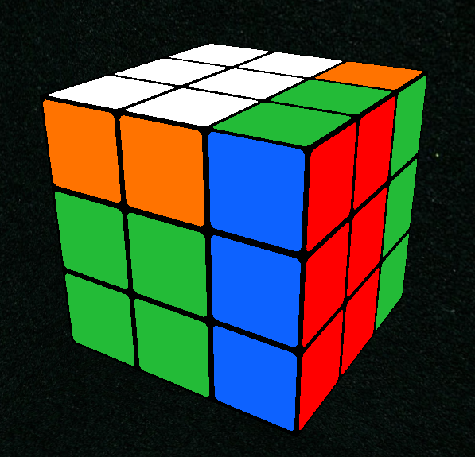
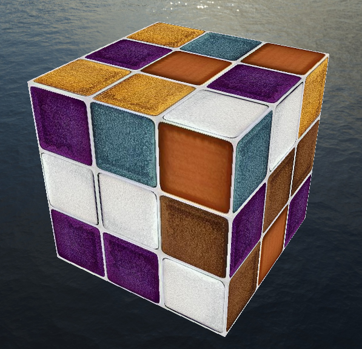
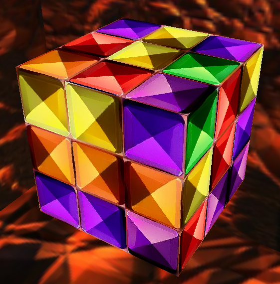
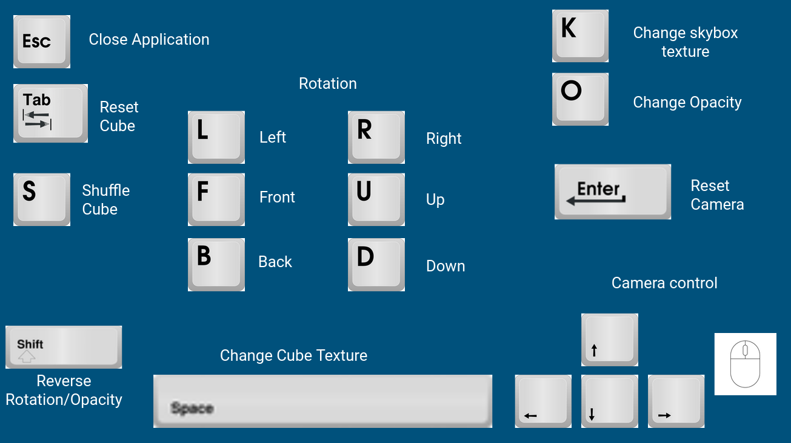

# RubiksCubeGL

RubiksCubeGL is an interactive OpenGL-based visualization program that allows users to interact with and solve a virtual Rubik's Cube. This README provides essential information about the project, its functionalities, and instructions for building and running the application.

# Features

- Interactive 3D Visualization: Experience a realistic 3D representation of a Rubik's Cube, allowing you to manipulate it easily using mouse or keyboard controls.
- Cube Rotation: Rotate the entire Rubik's Cube in three dimensions, simulating real-world movements.
- Customizable Appearance: Enjoy various color schemes to customize the look and feel of the virtual Rubik's Cube.

# Requirements

- OpenGL
- GLFW3
- C++
- CMake

# Building the Project

1. ```mkdir build```
2. ```cd build```
3. ```cmake ..```
4. ```make```
5. ```./rubiksCubeGL```

# Image Examples





# Controls


